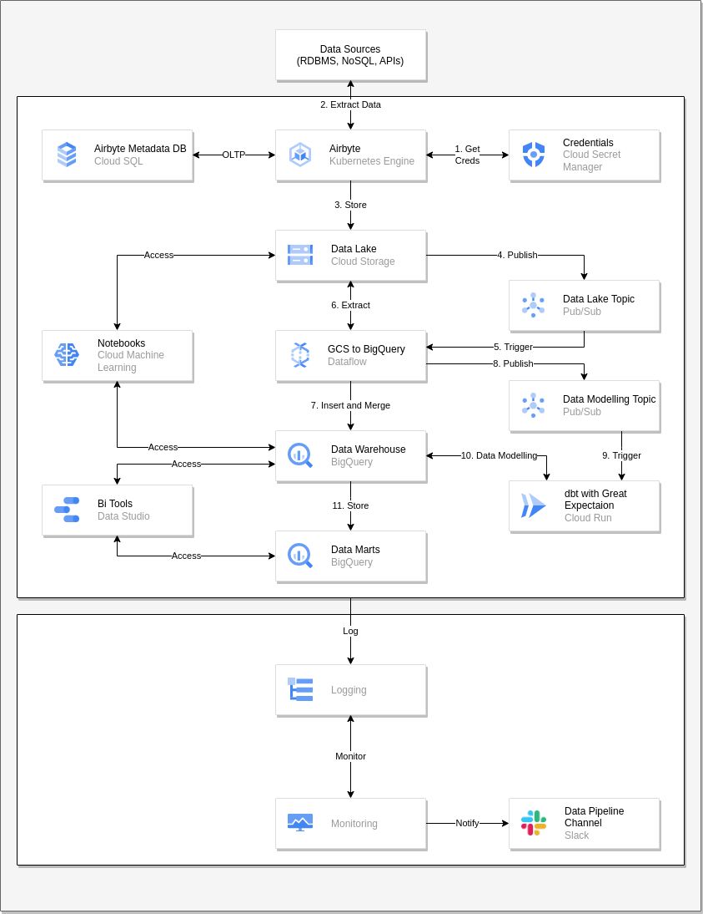

# Data Pipeline Architecture from Data Sources to GCS and BigQuery

1. The credentials to extract the data from the sources are stored in Secret Manager. So, Airbyte need to get the encrypted credentials from secret manger
2. Airbyte extract the data from the sources using the credentials that's retrieved from secret manager. Tha airbyte is deployed on Kubernetes to take the benefit of autoscaling. Even we cannot scale to 0, it's considerably okay as if there is a stream data source, the airbyte instance doesn't need to scale to 0. Airbyte also uses Cloud SQL as the metadata database as an OLTP.
3. Airbyte store the extracted data to Data Lake on GCS in `avro` or `parquet` format. The data in Data Lake can be accessed by Data Scientists using AI Platform or Vertex AI.
4. When the data is stored to GCS, it will publish event to Pub/Sub topic.
5. The Pub/Sub Topic will trigger the DataFlow Job that'll process the data from GCS to BigQuery.
6. DataFlow job extract the data from GCS based on the event triggered by Pub/Sub
7. DataFlow job insert and merge (to deduplicate) the processed data to BigQuery Data Warehouse. The BigQuery Data Warehouse can be accessed by Data Scientists and Data Analysts to gather insights.
8. When the DataFlow job finished, it will publish event to Pub/Sub Topic.
9. The Pub/Sub Topic will trigger dbt on Cloud Run.
10. dbt will perform data modelling on BigQuery Data Warehouse. This dbt integrated with Great Expectation as a Data Quality Validation Tools.
11. BigQuery execute the dbt data modelling job and store it to Data Marts. The data on Data Marts can be accessed by Data Analysts using BI Tools like Data Studio.

> Note: All the process are inside GCP environment and those can be linked to Cloud Logging. We can create Cloud Monitoring metrics and alert in case there is an error or unexpected event on logs. The alert can be processed to Slack channel to notify if there is an error or any unsual event happened in log.
